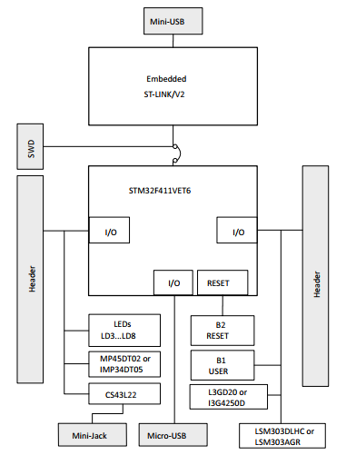
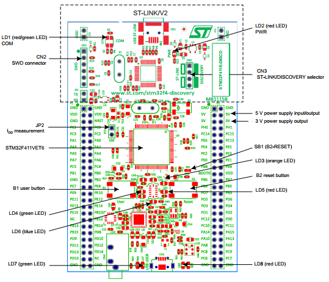
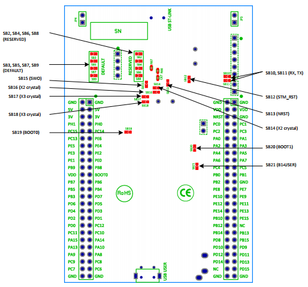

# STM32F411_Basic_Project
# STM32F411 DISCOVERY - STM32F411VE

## Đặc điểm:
- 512Kb Flash, 128Kb RAM, LQFP100 package
- 8 Led:
LD1 (red/green): for USB
LD2 (red): for 3.3V
User led: LD3 (orange), LD4 (green), LD5 (red), LD6 (blue)
2 USB OTG LED: LD7 (green) VBUS, LD8 (red) overcurrent
- 2 push button: user and reset
- Cấp 5V ngoài
## Bắt đầu:
- Jumpers JP2 và CN3 are ON (Discovery mode)
- Connect to PC thông qua USB ST-Link, LED LD2 (PWR) sáng, 4 led giữa 2 nút nhấn blinking.

## Cấu trúc phần cứng:

*Hardware Bock diagram:*  
  

*Top layout*  
  
 
*Bot layout*  
  
 
### *Power Supply and power selection:*
Nguồn có thể cấp từ PC hoặc 5V ngoài
- Khi là output, dòng tiêu thụ phải nhỏ hơn 100mA
- Khi là input, 5V đóng vai trò là nguồn cấp, USB không được cắm vào PC. Trong trường hợp này, tuân theo chuẩn EN-60950-1: 2006+A11/2009, và SELV
***LEDS:***
- LD1 COM: default RED, PC – Stlink : GREEN
- LD2 PWR: RED: nguồn được cấp
- User LD3: Orange I/O PD13
- User LD4: Green I/O PD12
- User LD5: Red I/O PD14
- User LD6: Blue I/O PD15
- USB LD7: Green: VBUS on CN5, nối vào PA9
- USB LD8: overcurrent
***Push Button***
- B1 User: I/O PA0
- B2 RESET: NRST

